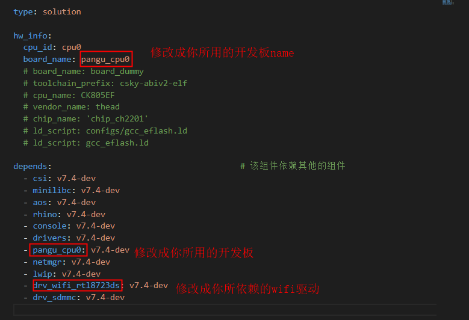
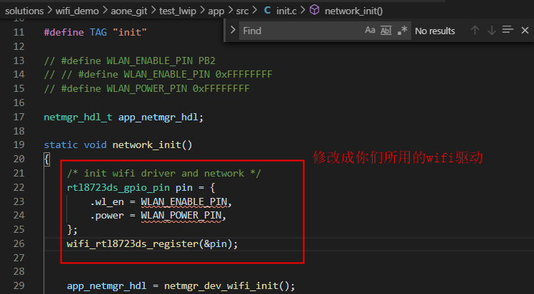
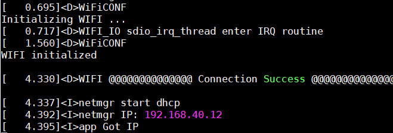
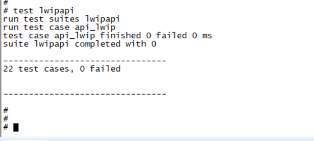
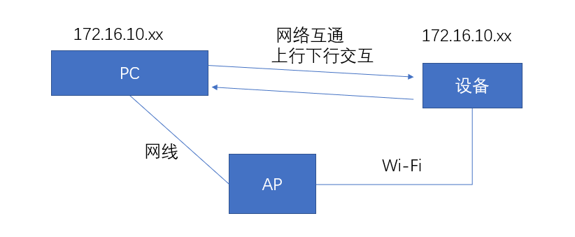
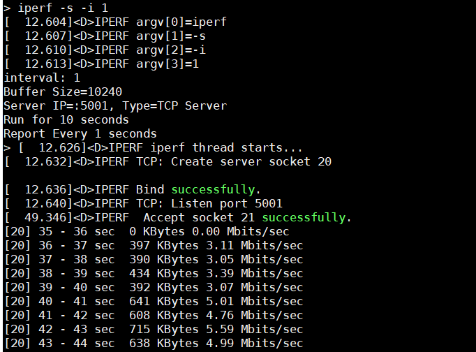
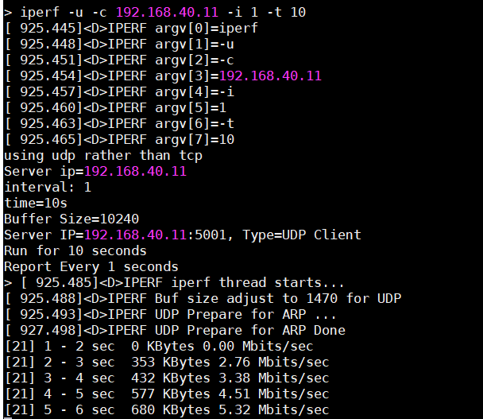

# LWIP测试操作手册

## 1. 概要

操作手册分为环境准备和测试LWIP两部分内容。环境准备主要介绍测试环境中所需的软硬件工具准备和安装。测试章节主要介绍程序编译及其编译前的准备工作，以及测试执行前的准备工作和执行中的具体操作步骤，明确具体的测试结果。


## 2. 环境准备

### 2.1硬件准备

| 设备   | 数量 | 功用                        |
| ------ | ---- | --------------------------- |
| PC     | 1    | 作为打流对象的SERVER/CLIENT |
| 开发板 | 1    | 测试对象                    |
| 串口线 | 1    | 烧写及查看log日志           |


### 2.2工具软件准备

| 软件名称       | 版本     | 功用   | 下载链接                                                     |
| -------------- | -------- | ------ | ------------------------------------------------------------ |
| 工具链         | V3.10.21 | 编译   | https://occ.t-head.cn/community/download?id=3782044712072974336 |
| CskyDebugServe | V5.10.4  | 调试用 | https://occ.t-head.cn/community/download_detail?id=616215132330000384 |

​    在Ubuntu子系统中（下列操作除了强调Windows客户端以外，其他操作都在Ubuntu子系统中完成），将工具链加入到环境变量中，例如csky-elfabiv2-tools-x86_64-minilibc-20200502.tar.gz解压后存放在自定义目录下，可在 该目录下找到 csky-elfabiv2-tools-x86_64-minilibc-20200502文件夹，文件夹内有 bin 文件夹， 将 bin 文件夹路径加入到环境变量。

将该路径加入到环境变量，执行命令： 

```yaml
export PATH=$PATH: /mnt/d/tools/csky-abiv2-elf-gcc/bin
```

将上述命令的路径替换为工具链实际所在目录路径即可。


### 2.3 开发板连接CskyDebugServer 

使用时，将串口和仿真接口通过数据线连接到电脑 USB 接口。在 windows 桌面双击打开 CskyDebugServer，连接开发板，连接成功会显示以下内容： 


## 3. 测试

安装yoctools 2.0.x版本，sudo pip install yoctools

初始化yoc，yoc init git@gitlab.alibaba-inc.com:thead_test_solutions/manifest.git

下载test_lwip代码，yoc install test_lwip


进入测试目录cd solutions/test_lwip;修改package.yaml的board_name为指定开发板，以及depends里的board内容替换成指定开发板，还有对应的wifi驱动，目前样例中使用的是8723，你需要修改成你们所依赖的驱动;



还有在app/src/init.c文件中，修改这段代码，替换成你所使用的wifi驱动




### 3.1 程序编译及烧写

**1、编译。**

测试目录下执行make命令编译程序：

```c
make clean;make
```

编译成功后会在目录下的generated内生成images.zip。


**2、烧写。**

烧录之前我们有个准备工作需要做一下：

测试目录下创建一个.gdbinit，文件中放入如下内容:

```c
target remote 172.31.0.196:1025
```

.gdbinit文件中的ip 地址从 CskyDebugServer 打印中获取, 连接 CskyDebugServer 步骤详情请见2.3节 。

测试目录下执行烧写命令：

```c
make flashall
```


**3、联网。**

在烧写完成后，先重启开发板，然后使用kv指令设置wifi名称和wifi密码

下例表示设置wifi名称为Test，wifi密码为123456的AP

```c
kv set wifi_ssid Test   
kv set wifi_psk 123456
```

设置成功后，重启开发板 ，看到拿到IP的打印即联网成功




### 3.1 LWIP API 测试

**输入命令     test lwipapi**

可看到结果全PASS，如下：




### 3.2 LWIP Solution 测试

**需要先准备和开发板网络互通的PC机，且PC机上安装了iperf，若未安装，在Ubuntu下使用命令sudo apt-get install iperf安装**

拓扑图如下：



**1、DUT做tcp server**

​        1.DUT输入iperf -s -i 1
​        2.PC端输入iperf -c DUTip -i 1 -t 10

查看打印<D>IPERF Bind successfully. 且打流信息正常




**2、DUT做udp server**

​        1.DUT输入iperf -u -s -i 1
​	    2.PC端输入iperf -u -c DUTip -i 1 -t 10

查看打印<D>IPERF iperf thread starts… 且打流信息正常


**3、DUT做tcp client**

​        1.PC端输入iperf -s -i 1

​        2.DUT输入iperf -c 主机ip -i 1 -t 10

查看打印<D>IPERF TCP: Connect server successfully. 且打流信息正常


**4、DUT做udp client**

​        1.PC端输入iperf -u -s -i 1

​        2.DUT输入iperf -u -c 主机ip -i 1 -t 10

查看打印<D>IPERF UDP Prepare for ARP Done 且打流信息正常

